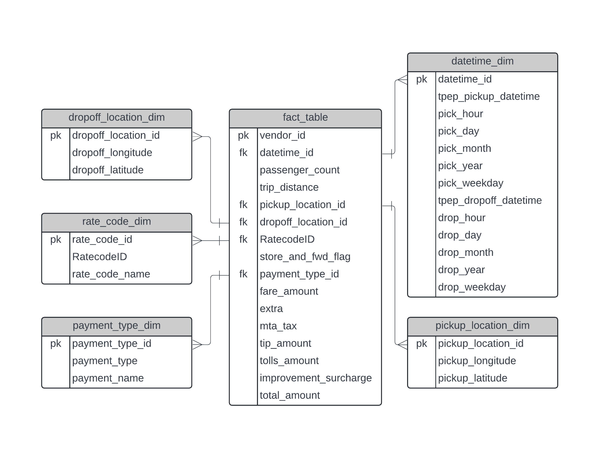
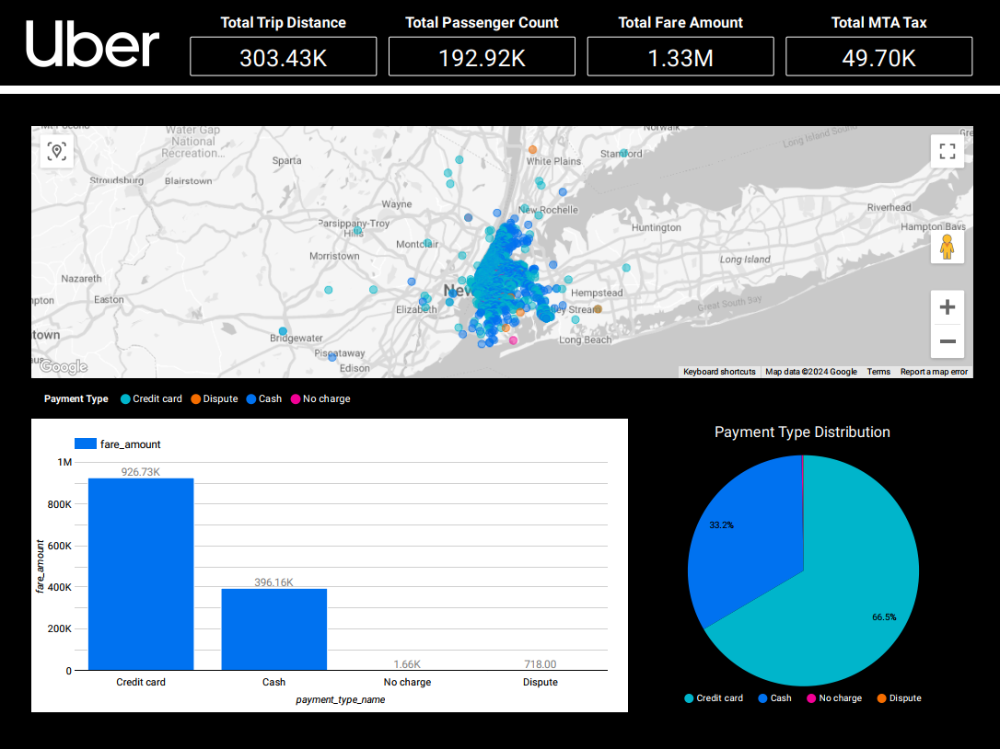

# Uber Data Analytics | End to End Data Engineering

## Introduction

An end-to-end data engineering project using an Uber dataset that involves creating a dimensional model, performing ETL with a Mage Data Pipeline on a Google Cloud Compute instance, and utilizing BigQuery for SQL queries and visualizations through Looker.

## Architecture 

## Technology Used
- Programming Language - Python

Google Cloud Platform
1. Google Storage
2. Compute Instance 
3. BigQuery
4. Looker Studio

Modern Data Pipeine Tool - https://www.mage.ai/

## Dataset Used
TLC Trip Record Data
Yellow and green taxi trip records include fields capturing pick-up and drop-off dates/times, pick-up and drop-off locations, trip distances, itemized fares, rate types, payment types, and driver-reported passenger counts. 

More info about dataset can be found here:
1. Website - https://www.nyc.gov/site/tlc/about/tlc-trip-record-data.page
2. Data Dictionary - https://www.nyc.gov/assets/tlc/downloads/pdf/data_dictionary_trip_records_yellow.pdf

## Data Model

## Sample Looker Visualization

This is a sample dashboard. Data analysts can create their own dashboards tailored to their specific use cases since the data is at an atomic level.

See Sample Dashboard: https://lookerstudio.google.com/reporting/e9764425-6638-4eba-ac09-e9e3977c28fc

## Credits
All of the credits belong to Darshil Parmar for inspiration and resource.
